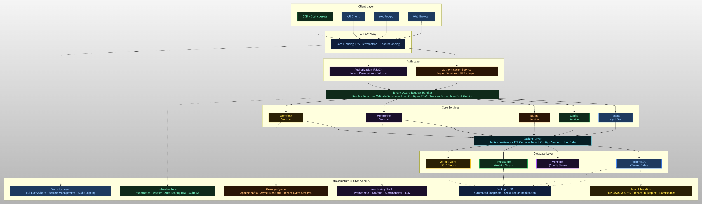

# CloudSuite – Multi-Tenant SaaS Platform

A production-inspired Multi-Tenant SaaS Platform designed using modern cloud architecture principles including:

- Tenant Isolation
- Role Based Access Control (RBAC)
- Authentication & Authorization
- Configuration Management
- Billing & Subscription Management
- Monitoring & Observability
- Redis Caching
- PostgreSQL Row Level Security
- Kafka Event Streaming
- Kubernetes Deployment Architecture

Designed as a System Design & Cloud Architecture Project.

## Architecture Diagram



# CloudSuite – Multi-Tenant SaaS Platform

## Project Overview

CloudSuite is a Python-based design and implementation of a scalable, secure, multi-tenant SaaS platform. The project demonstrates core architectural concepts used in real-world platforms like Salesforce and Zoho, including tenant isolation, RBAC, caching, billing, and monitoring — all in a single, well-documented Python file.

**GitHub Repository:** `https://github.com/YOUR_USERNAME/CloudSuite-MultiTenant-SaaS`  
*(Replace with your actual GitHub link after upload)*

---

## Features Implemented

| Module | Description |
|---|---|
| Tenant Management | Onboard, upgrade, suspend, and offboard tenants |
| Authentication | Tenant-scoped login, session management, logout |
| Authorization (RBAC) | Role-based permission enforcement (5 roles) |
| Config Service | Tenant-specific config with TTL cache (cache-aside) |
| Request Handler | Tenant-aware middleware pipeline |
| Billing Service | Subscription records per plan |
| Monitoring Service | Per-tenant metric events and health check |
| Data Isolation | Tenant-scoped in-memory tables; cross-tenant access blocked |

---

## Project Structure

```
CloudSuite/
├── cloudsuite.py        # Complete Python implementation
├── README.md            # This file
├── architecture.png     # System architecture diagram
└── documentation.pdf    # Full project documentation PDF
```

---

## Dependencies

| Dependency | Version | Purpose |
|---|---|---|
| Python | 3.8+ | Runtime |
| Standard Library only | — | uuid, hashlib, logging, dataclasses, enum, typing |

> **No external packages required.** The implementation uses only Python's standard library.

---

## Setup Instructions

### 1. Clone the Repository

```bash
git clone https://github.com/YOUR_USERNAME/CloudSuite-MultiTenant-SaaS.git
cd CloudSuite-MultiTenant-SaaS
```

### 2. Verify Python Version

```bash
python --version
# Should be Python 3.8 or higher
```

### 3. (Optional) Create a Virtual Environment

```bash
python -m venv venv
source venv/bin/activate      # Linux / macOS
venv\Scripts\activate         # Windows
```

---

## Execution Steps

### Run the Full Demo

```bash
python cloudsuite.py
```

This executes a 16-step demo that covers:

1. Onboard two tenants (Acme Corp on PROFESSIONAL, Beta Startup on FREE)
2. Register admin and member users
3. Authenticate and create sessions
4. Load tenant-specific configuration (with cache hit demonstration)
5. Write customer data via tenant-aware request handler
6. Read data back as a lower-privileged member
7. Attempt cross-tenant data access (blocked – demonstrates isolation)
8. Attempt unauthorized config update as MEMBER (RBAC denial)
9. Admin successfully updates tenant config
10. View billing records
11. Upgrade tenant plan from FREE to ENTERPRISE
12. View per-tenant monitoring metrics
13. Platform health check
14. Suspend tenant and verify access is blocked

### Expected Output

```
=================================================================
  CloudSuite Multi-Tenant SaaS Platform - Demo
=================================================================

[1] Onboarding Tenant A (Acme Corp) on PROFESSIONAL plan...
    Tenant ID : tenant_xxxxxxxxxxxx
    Admin ID  : user_xxxxxxxxxxxx
...
=================================================================
  Demo Complete ✓
=================================================================
```

---

## Architecture Overview

The system follows a layered architecture:

```
Client Request
     │
     ▼
TenantAwareRequestHandler  ← resolves tenant, validates session, loads config
     │
     ├── AuthenticationService   ← login, session validation, logout
     ├── AuthorizationService    ← RBAC permission checks
     ├── ConfigurationService    ← tenant config with TTL cache
     ├── TenantManagementService ← onboarding, plan changes, suspension
     ├── BillingService          ← subscription and invoice management
     └── MonitoringService       ← per-tenant metrics and health checks
           │
           ▼
     InMemoryDatabase  ← tenant-isolated storage (maps to PostgreSQL in prod)
```

---

## Key Design Decisions

- **Shared infrastructure, isolated data:** All tenants share the same codebase and runtime. Data is isolated via `tenant_id` scoping on every DB query — analogous to PostgreSQL Row-Level Security.
- **Cache-aside pattern:** Tenant configs are cached in a TTL-based dictionary (production: Redis). Cache is invalidated on every config update.
- **RBAC with 5 roles:** `SUPER_ADMIN → TENANT_ADMIN → MANAGER → MEMBER → VIEWER`, each with additive permission sets.
- **Plan-based resource limits:** `FREE / STARTER / PROFESSIONAL / ENTERPRISE` plans enforce user caps, storage limits, and API rate limits.
- **Session-based auth:** Sessions carry `tenant_id`, preventing cross-tenant session reuse.

---

## Additional Details

- The `InMemoryDatabase` class simulates a relational DB with tenant-aware isolation. In production, this maps to PostgreSQL with row-level security or separate schemas per tenant.
- The `TenantAwareRequestHandler.handle()` method is the core middleware that enforces all security checks before dispatching any action.
- All services are stateless and can be horizontally scaled behind a load balancer.
- Monitoring events are structured for easy export to Prometheus/Grafana in a production setup.
